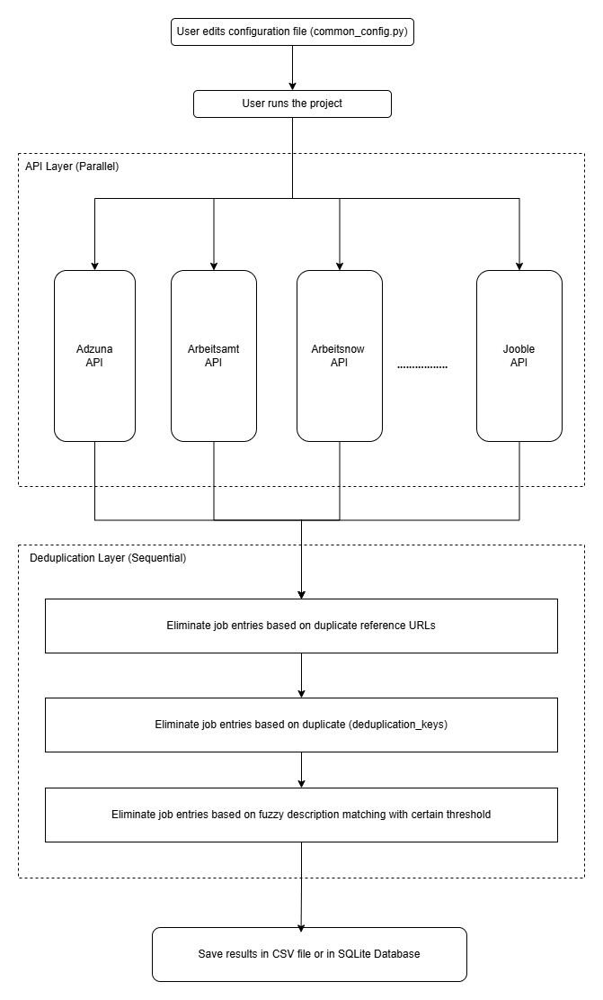

# Multi-Source Job Aggregator – Python API & Data Pipeline Project 

This project is a modular Python-based job aggregator that integrates multiple public APIs to collect, normalize, and deduplicate job listings into a unified dataset.
It demonstrates practical skills in API integration, data processing, and building simple data pipelines with clean architecture.

## Project Pipeline

  

### Project tries to solve following 2 central problems
- No need to repeat the same tasks on different job boards. Just edit the config once and then let project do job board hopping on the behalf of user.
- No need to search for different synonymes keywords (e.g python entwickler, python developer, python software developer, etc.) on the same job board website, just list all synonyms at once in the keywords list and project will iterate through all of them.

## Project Extension Ideas
- Famous job board websites like Indeed, Stepstone, Glassdoor, etc. can be scrapped (**if allowed in their terms and conditions**) to improve the output quality.

## TODO

> **Project Status:** Work in progress — ongoing development.
